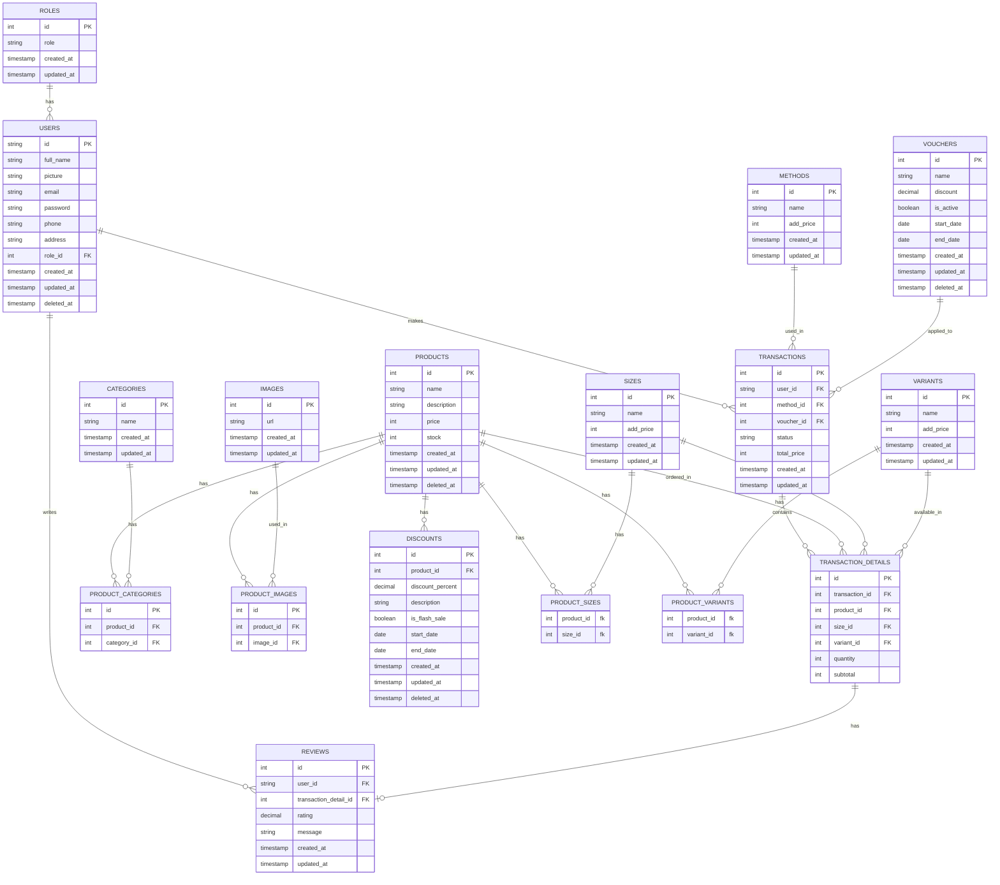

```mermaid
erDiagram

    ROLES ||--o{ USERS : has
    USERS ||--o{ TRANSACTIONS : makes
    USERS ||--o{ REVIEWS : writes
    USERS {
        string id PK
        string full_name
        string picture
        string email
        string password
        string phone
        string address
        int role_id FK
        timestamp created_at
        timestamp updated_at
        timestamp deleted_at
    }

    ROLES {
        int id PK
        string role
        timestamp created_at
        timestamp updated_at
    }

    METHODS ||--o{ TRANSACTIONS : used_in
    VOUCHERS ||--o{ TRANSACTIONS : applied_to
    TRANSACTIONS ||--o{ TRANSACTION_DETAILS : contains
    TRANSACTIONS {
        int id PK
        string user_id FK
        int method_id FK
        int voucher_id FK
        string status
        int total_price
        timestamp created_at
        timestamp updated_at
    }

    PRODUCTS ||--o{ TRANSACTION_DETAILS : ordered_in
    SIZES ||--o{ TRANSACTION_DETAILS : available_in
    VARIANTS ||--o{ TRANSACTION_DETAILS : available_in
    TRANSACTION_DETAILS ||--o| REVIEWS : has
    TRANSACTION_DETAILS {
        int id PK
        int transaction_id FK
        int product_id FK
        int size_id FK
        int variant_id FK
        int quantity
        int subtotal
    }

    PRODUCTS ||--o{ PRODUCT_CATEGORIES : has
    PRODUCTS ||--o{ PRODUCT_IMAGES : has
    PRODUCTS ||--o{ DISCOUNTS : has
    PRODUCTS {
        int id PK
        string name
        string description
        int price
        int stock
        timestamp created_at
        timestamp updated_at
        timestamp deleted_at
    }

    CATEGORIES ||--o{ PRODUCT_CATEGORIES : has
    CATEGORIES {
        int id PK
        string name
        timestamp created_at
        timestamp updated_at
    }

    PRODUCT_CATEGORIES {
        int id PK
        int product_id FK
        int category_id FK
    }

    METHODS {
        int id PK
        string name
        int add_price
        timestamp created_at
        timestamp updated_at
    }

    SIZES {
        int id PK
        string name
        int add_price
        timestamp created_at
        timestamp updated_at
    }

    VARIANTS {
        int id PK
        string name
        int add_price
        timestamp created_at
        timestamp updated_at
    }

    IMAGES ||--o{ PRODUCT_IMAGES : used_in
    IMAGES {
        int id PK
        string url
        timestamp created_at
        timestamp updated_at
    }

    PRODUCT_IMAGES {
        int id PK
        int product_id FK
        int image_id FK
    }

    REVIEWS {
        int id PK
        string user_id FK
        int transaction_detail_id FK
        decimal rating
        string message
        timestamp created_at
        timestamp updated_at
    }

    DISCOUNTS {
        int id PK
        int product_id FK
        decimal discount_percent
        string description
        boolean is_flash_sale
        date start_date
        date end_date
        timestamp created_at
        timestamp updated_at
        timestamp deleted_at
    }

    VOUCHERS {
        int id PK
        string name
        decimal discount
        boolean is_active
        date start_date
        date end_date
        timestamp created_at
        timestamp updated_at
        timestamp deleted_at
    }
    PRODUCTS ||--o{ PRODUCT_SIZES : has
    SIZES ||--o{ PRODUCT_SIZES : has
    PRODUCT_SIZES {
        int product_id fk
        int size_id fk
    }

    PRODUCTS ||--o{ PRODUCT_VARIANTS : has
    VARIANTS ||--o{ PRODUCT_VARIANTS : has
    PRODUCT_VARIANTS {
        int product_id fk
        int variant_id fk
    }
```