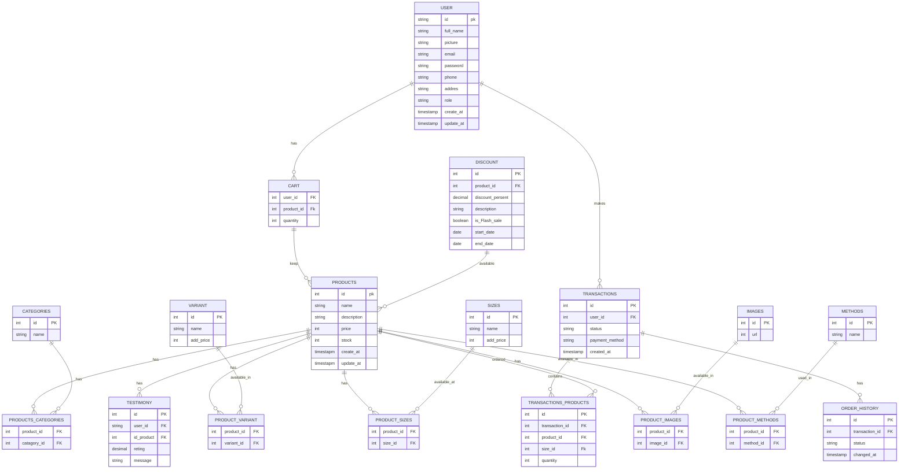

# Coffee Shop ERD (ENTITY RELATIONSHIP DIAGRAM)

```mermaid
erDiagram


    USER ||--O{ CART : has
    USER ||--o{ TRANSACTIONS : makes
    USER {
        string id pk 
        string full_name
        string picture
        string  email
        string password
        string phone
        string addres 
        string role
        timestamp create_at
        timestamp update_at
    }

    CART ||--O{ PRODUCTS : keep
    CART{
        int user_id FK
        int product_id Fk
        int quantity

    }

    TRANSACTIONS ||--o{ TRANSACTIONS_PRODUCTS : contains
    TRANSACTIONS ||--o{ ORDER_HISTORY : has
    TRANSACTIONS {
        int id PK
        int user_id FK
        string status
        string payment_method
        timestamp created_at
    }

    TRANSACTIONS_PRODUCTS {
        int id PK
        int transaction_id FK
        int product_id FK
        int size_id Fk
        int quantity
    }

    ORDER_HISTORY {
        int id PK
        int transaction_id FK
        string status
        timestamp changed_at
    }

    PRODUCTS ||--O{ PRODUCTS_CATEGORIES : has
    PRODUCTS ||--O{ TESTIMONY : has
    PRODUCTS ||--o{ PRODUCT_VARIANT : has
    PRODUCTS ||--o{ PRODUCT_SIZES : has
    PRODUCTS ||--o{ TRANSACTIONS_PRODUCTS : ordered
    PRODUCTS ||--o{ PRODUCT_IMAGES : has
    PRODUCTS ||--o{ PRODUCT_METHODS : available_in
    PRODUCTS {
        int id pk
        string name
        string description
        int price
        int stock
        timestapm create_at
        timestapm update_at
    }

    CATEGORIES ||--o{ PRODUCTS_CATEGORIES : has
    CATEGORIES {
        int id PK
        string name
    }
    PRODUCTS_CATEGORIES{
        int product_id FK
        int catagory_id FK
    }

    METHODS  ||--o{ PRODUCT_METHODS : used_in
    METHODS {
        int id PK
        string name
    }
    PRODUCT_METHODS {
        int product_id FK
        int method_id FK
    }

    SIZES ||--o{ PRODUCT_SIZES : avaliable_at
    SIZES {
        int id PK
        string name 
        int add_price
    }
    PRODUCT_SIZES{
        int product_id FK
        int size_id FK
    }

    VARIANT ||--O{ PRODUCT_VARIANT : available_in
    VARIANT {
        int id PK
        string name
        int add_price
    }
    PRODUCT_VARIANT{
        int product_id FK
        int variant_id FK
    }

    IMAGES ||--o{ PRODUCT_IMAGES : available_in
    IMAGES{
        int id PK
        int url
    }
    PRODUCT_IMAGES{
        int product_id FK
        int image_id FK
    }
    TESTIMONY{
        int id PK
        string user_id FK
        int id_product FK
        desimal reting
        string message 
    }

    DISCOUNT ||--O{ PRODUCTS : available
    DISCOUNT {
        int id PK
        int product_id FK
        decimal discount_persent
        string description
        boolean is_Flash_sale
        date start_date
        date end_date
    }
```